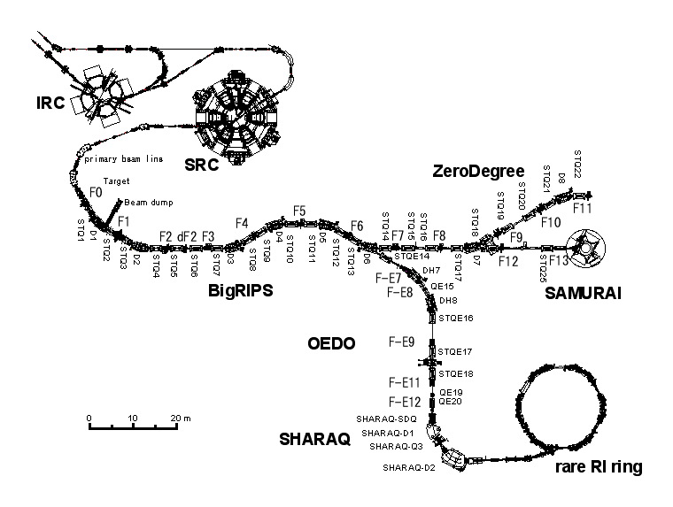

# Beamline Overview

## Beamline Chain

PIS (polarized ion source)
-> Injector / RILAC
-> Cyclotron chain (RRC -> fRC -> IRC -> SRC)
-> BigRIPS (fragment separator, F0-F13)
-> SAMURAI beamline / target
-> SAMURAI spectrometer + detectors

## Polarization Budget

The working decomposition used in this folder is

`P(SAMURAI) = P(source) x transport effects x beamline effects x systematics`

The documents under `beamline_info/` mainly constrain the `beamline effects` and the mechanical interfaces near SAMURAI.

## Reading Guide

- Use [contacts-and-interfaces.md](contacts-and-interfaces.md) when you need to know who owns which beamline question.
- Use [../bigrips/slits/acceptance-and-loss.zh.md](../bigrips/slits/acceptance-and-loss.zh.md) for the BigRIPS slit and transmission background.
- Use [../samurai/beam-pipe/overview.md](../samurai/beam-pipe/overview.md) and [../samurai/beam-pipe/jis-flange-reference.md](../samurai/beam-pipe/jis-flange-reference.md) for the upstream pipe chain and flange standards.
- Use [../samurai/upstream-detector/questionnaire.en.md](../samurai/upstream-detector/questionnaire.en.md) when preparing external questions about the upstream detector installation boundary.
