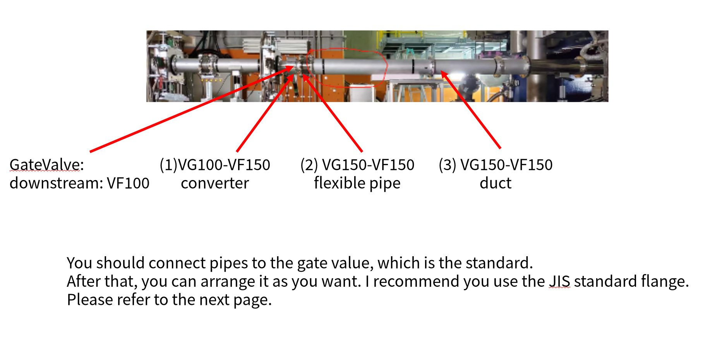
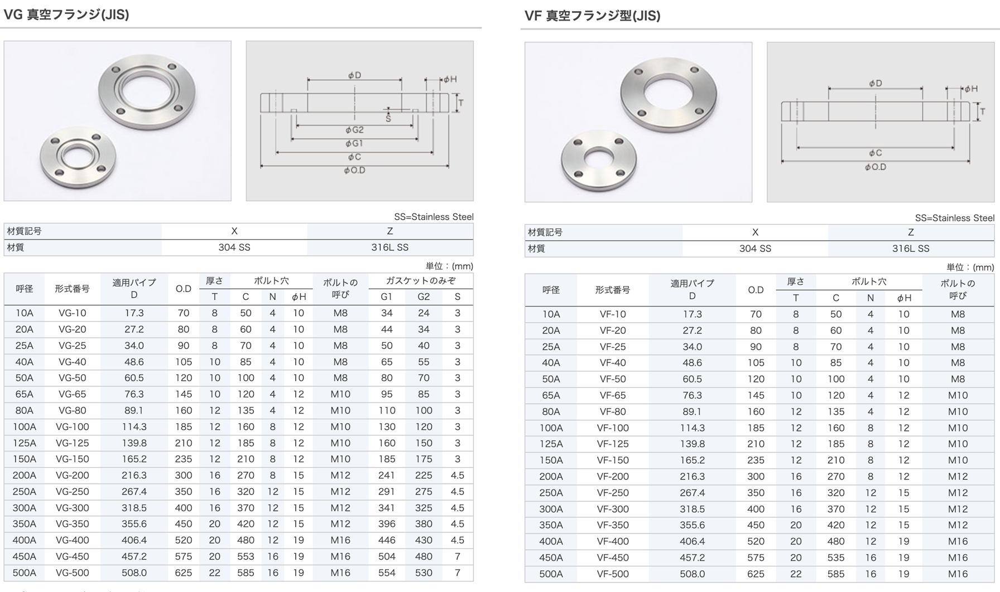

# SAMURAI JIS Flange Reference

This page collects the flange standard notes used for the pipe section immediately upstream of SAMURAI.

## Working Interface Rules

- Upstream interfaces in this section are treated as `VG` type with O-ring sealing.
- Downstream faces of the pipe pieces are treated as `VF` type without the O-ring groove.
- The current mechanical assumption is that the CH2 target chamber upstream side should be `VG150`.
- The practical guidance from the beamline note is: match the gate-valve standard first, then adapt the rest with JIS flanges.

## Local Context

## JIS VG/VF Quick Reference

| Type | Nominal size | Pipe OD (mm) | Flange OD (mm) | Thickness (mm) | Bolt holes | Bolt spec |
|---|---:|---:|---:|---:|---:|---:|
| VG | 100A | 114.3 | 185 | 12 | 8 x 12 | M10 |
| VG | 150A | 165.2 | 235 | 12 | 8 x 12 | M10 |
| VF | 100A | 114.3 | 185 | 12 | 8 x 12 | M10 |
| VF | 150A | 165.2 | 235 | 12 | 8 x 12 | M10 |

For the full dimensional table and downloadable CAD data, refer to:

- https://www.yako-sangyo.co.jp/cn/pages/122/
- https://www.yako-sangyo.co.jp/en/pages/117/
