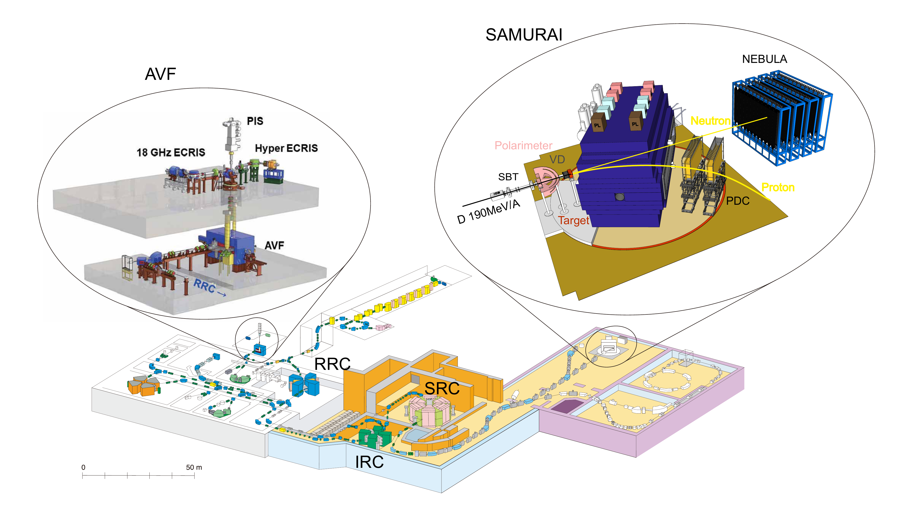
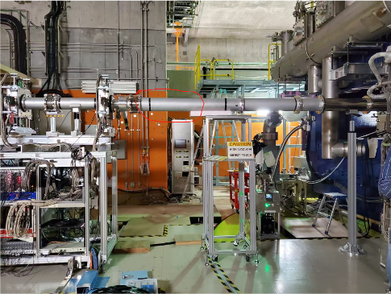
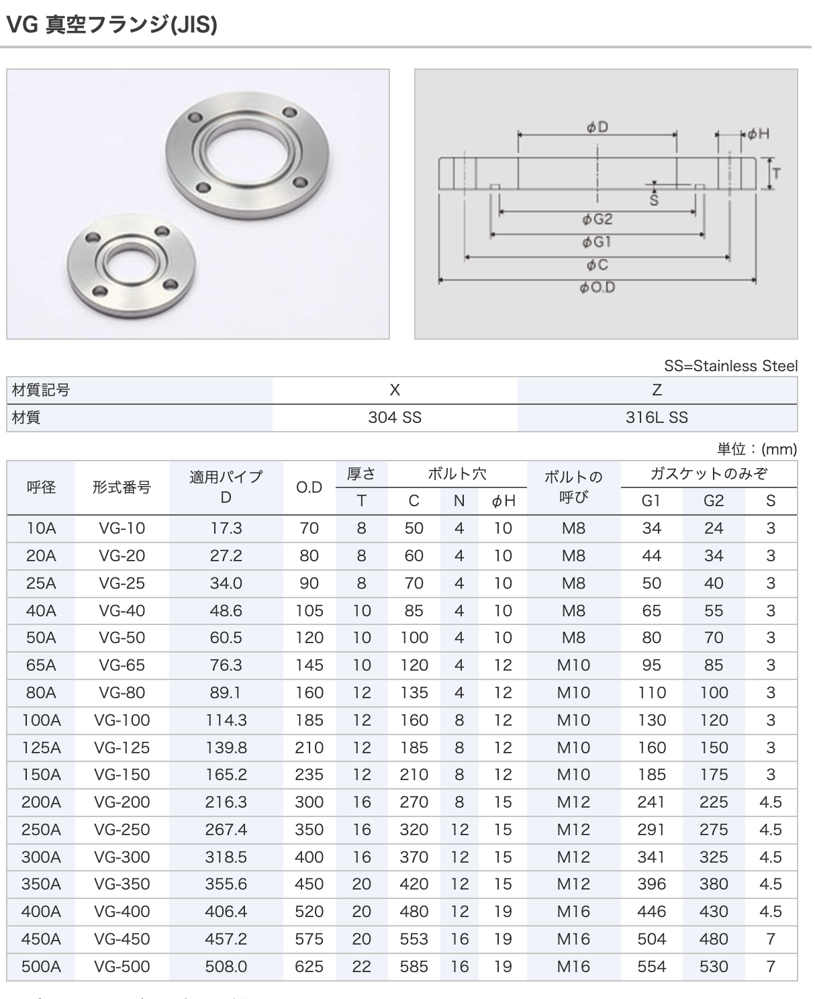
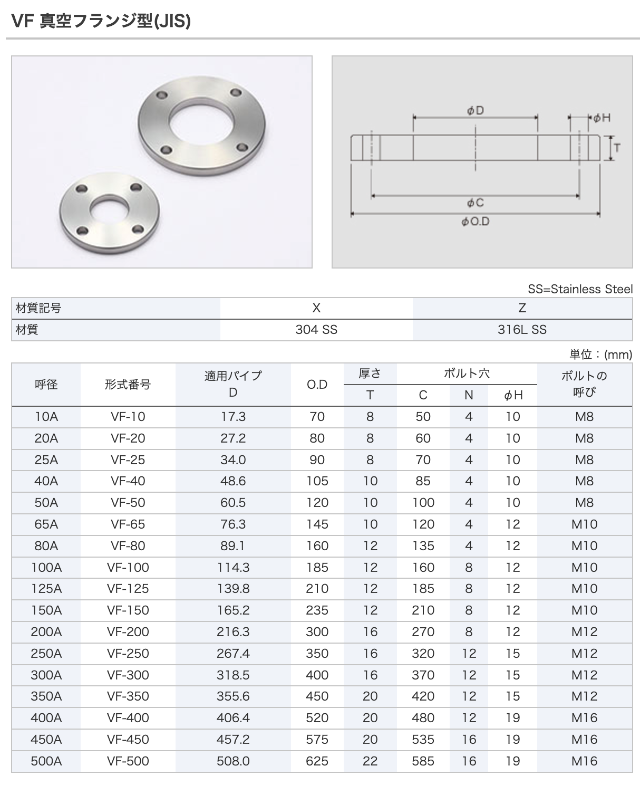

# Upstream Detector Placement: Interface and Space Questionnaire (for SAMURAI beamline integration)

Updated: 2026-03-18

## 1. Context

A dual-location detector idea was discussed (`upstream` and `in front of SAMURAI`).
For this round, we only request upstream-side mechanical boundary inputs so that interface sizing and installation feasibility can be fixed first.

This is a primary-beam experiment, not a secondary-beam setup.

## 2. Questions to Send (Upstream Only)

### A. Upstream Interface Definition

1. What is the exact upstream interface standard (`JIS` / `VG` / `VF` / `ICF` / custom)?
2. What are the exact flange parameters at the upstream connection point?
   - nominal size (A)
   - ID / OD
   - bolt count and bolt-circle (PCD)
   - gasket/O-ring requirement
3. Is the mating side fixed as `VG` upstream and `VF` downstream for this section?
4. Is there any mandatory gate-valve model or port standard at the upstream boundary?

### B. Upstream Installation Space Envelope

1. What is the available straight installation length along beam axis (mm)?
2. What is the allowed 3D envelope (`X / Y / Z`, mm) around the upstream installation location?
3. What is the maximum allowed mass and center-of-mass offset constraint?
4. Are there no-go volumes due to magnets, supports, shielding, cable trays, or maintenance paths?
5. What is the minimum service clearance needed for assembly and disassembly tools?

### C. Upstream Line-of-Sight and Aperture

1. Along the upstream to SAMURAI-front path, what is the minimum effective aperture and where?
2. Are there fixed obstacles (slit, collimator, window, diagnostics, supports) that define the hard envelope?
3. Are there movable components that can intrude into this path during operation?

## 3. Reply Template

| Item | Value | Notes |
|---|---:|---|
| Interface standard |  |  |
| Nominal size (A) |  |  |
| Flange ID (mm) |  |  |
| Flange OD (mm) |  |  |
| Bolt circle PCD (mm) |  |  |
| Bolt count |  |  |
| O-ring / gasket type |  |  |
| Available straight length (mm) |  |  |
| Allowed envelope X (mm) |  |  |
| Allowed envelope Y (mm) |  |  |
| Allowed envelope Z (mm) |  |  |
| Allowed mass (kg) |  |  |
| Minimum effective aperture (mm) |  |  |

## 4. Supporting Figures and Interface Notes

### 4.1 Beamline Schematic

Source file: [`source/schematic-of-beamline.pdf`](source/schematic-of-beamline.pdf)

### 4.2 Local Installation Context

The current pipe labels extracted from the PPTX are:

- GateValve: downstream side is `VF100`
- Pipe (1): `VG100-VF150` converter
- Pipe (2): `VG150-VF150` flexible pipe
- Pipe (3): `VG150-VF150` duct
- Guidance note: connect to the gate-valve standard first, then arrange the rest (`JIS` flange recommended)

### 4.3 Quick JIS Flange Reference Used by the Discussion

For the combined table and supplier links, see [../beam-pipe/jis-flange-reference.md](../beam-pipe/jis-flange-reference.md).

### 4.4 Quick Flange Mapping Used in the Pipe Labels

| Label in the discussion | Upstream side | Downstream side | Type note |
|---|---|---|---|
| GateValve | - | VF100 | fixed gate-valve boundary |
| (1) converter | VG100 | VF150 | converter |
| (2) flexible pipe | VG150 | VF150 | flexible section |
| (3) duct | VG150 | VF150 | rigid duct |

## 5. Practical Note

For this stage, only upstream interface and space constraints are requested.
Do not freeze the final detector mechanics before Section 3 is fully answered.
