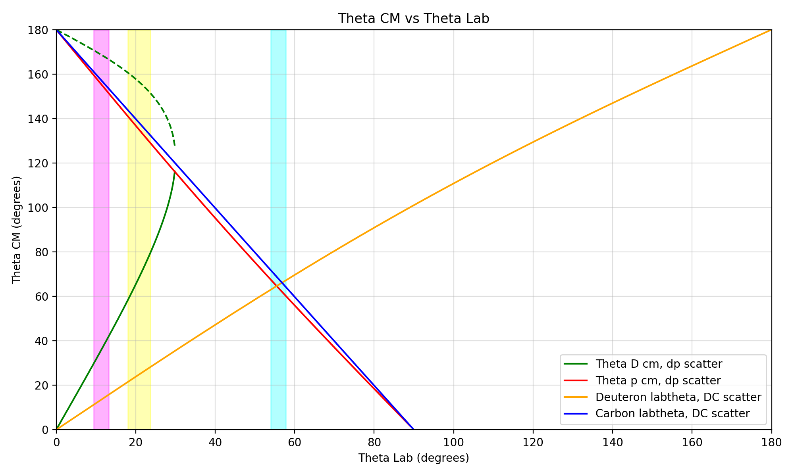
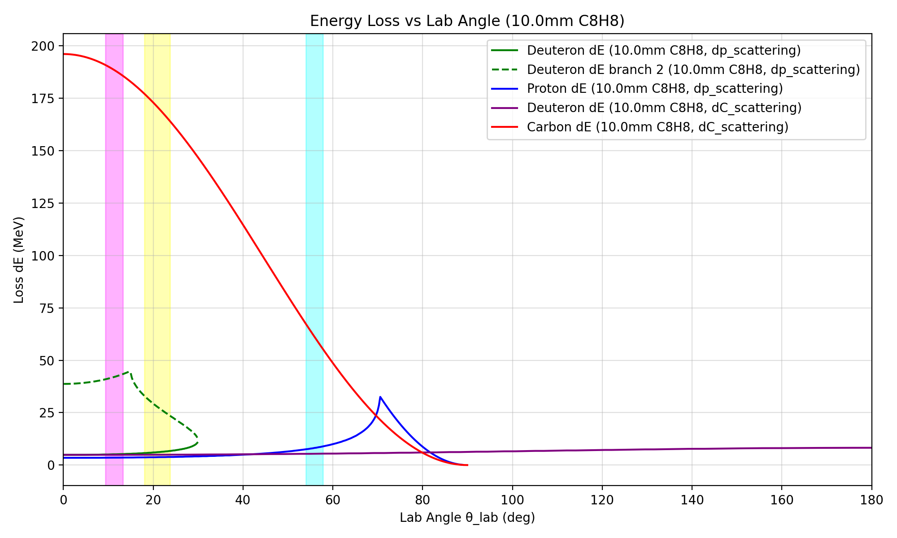

# Why the Three-Angle Coincidence Selects Elastic dp Scattering

In a CH2 target, the immediate concern is whether elastic scattering on hydrogen,

`1H(d,d)p`

can be distinguished from elastic scattering on carbon,

`12C(d,d)12C`,

and from other possible backgrounds. For the present detector geometry, the answer is yes at the coincidence level: when one detector is placed at the deuteron arm angle and two detectors are placed at the two proton arm angles listed below, the accepted two-arm coincidence locus is the elastic `dp` locus, while elastic `dC` is rejected.

## Detector placement in the laboratory frame

- Deuteron arm `D`: `20.87 deg +/- 2.86 deg`
- Proton arm `P1`: `55.9 deg +/- 1.91 deg`
- Proton arm `P2`: `11.3 deg +/- 1.91 deg`

These angular widths come from the current detector sizes and distances used in the layout study. The dectors are useing C8H8 material.

## 1. Theta-relation argument

The colored vertical bands mark the acceptance of the three detector positions. The curves show the calculated kinematic relation between laboratory angle and center-of-mass angle for the elastic `dp` and elastic `dC` channels.

The key point is that the `D` arm and the proton arms couple to the same `theta_cm` only for elastic `dp`:

- The `D` arm accepts elastic `dp` deuterons in two `theta_cm` windows:
  - `59.1-79.2 deg`
  - `151.6-160.3 deg`
- The `P1` arm accepts elastic `dp` protons in:
  - `60.2-67.1 deg`
- The `P2` arm accepts elastic `dp` protons in:
  - `151.4-159.1 deg`

Therefore:

- `D + P1` coincidence selects the forward elastic `dp` branch
- `D + P2` coincidence selects the backward elastic `dp` branch

For elastic `dC`, the same coupling does not exist:

- In the `D` arm, elastic `dC` deuterons appear only at:
  - `21.8-27.8 deg` in `theta_cm`
- At the proton-arm angles, the elastic `dC` carbon branch appears at:
  - `64.5-71.7 deg` for `P1`
  - `153.5-160.7 deg` for `P2`

There is no common `theta_cm` interval between the elastic `dC` deuteron accepted by the `D` arm and the elastic `dC` carbon accepted by either proton arm. In other words, elastic `dC` can produce single-arm hits, but it cannot produce the required `D-P1` or `D-P2` coincidence.

## 2. Energy-loss argument

The energy-loss plot gives a second and independent discriminator. At the proton-arm angles, the elastic `dp` proton signal and the elastic `dC` carbon signal are far apart in `Delta E`:

- In `P1`:
  - elastic `dp` proton: `7.6-8.9 MeV`
  - elastic `dC` carbon: `55.8-67.2 MeV`
- In `P2`:
  - elastic `dp` proton: `3.52-3.58 MeV`
  - elastic `dC` carbon: `185.8-190.6 MeV`

So even if a carbon particle reaches a detector located at a proton-arm angle, it does not look like a proton in energy loss.

The `D` arm by itself is not always sufficient for clean separation:

- elastic `dp` forward deuteron in the `D` arm: `5.74-6.71 MeV`
- elastic `dC` deuteron in the `D` arm: `4.91-4.96 MeV`

These are relatively close. This is exactly why the coincidence condition is important. The clean rejection of elastic `dC` comes from the combination of:

- the angle-coupled `D-P1` or `D-P2` coincidence, and
- the proton-like energy-loss band in the proton arm

## 3. Practical conclusion

With detectors placed at the three laboratory angles

- `20.87 deg` for the deuteron arm,
- `55.9 deg` for proton arm `P1`,
- `11.3 deg` for proton arm `P2`,

and with the event defined as

1. a hit in the `D` arm, and
2. a coincident proton-like hit in either `P1` or `P2`,

the accepted coincidence corresponds to elastic `dp` scattering. Elastic `dC` is excluded because it does not satisfy the same angular coupling, and because its carbon branch does not match the proton `Delta E` locus in the proton arms.

## 4. What can be claimed

This note explicitly demonstrates rejection of the dominant ambiguity from the carbon content of the CH2 target, namely elastic `dC`. Any other reaction would still have to satisfy the same narrow coincidence condition and the same proton-arm energy-loss condition, so it is more constrained than elastic `dC`. A full rejection-factor study for every non-elastic channel would require dedicated reaction-by-reaction simulation, but the coincidence locus accepted by this three-angle layout is the elastic `dp` locus.
