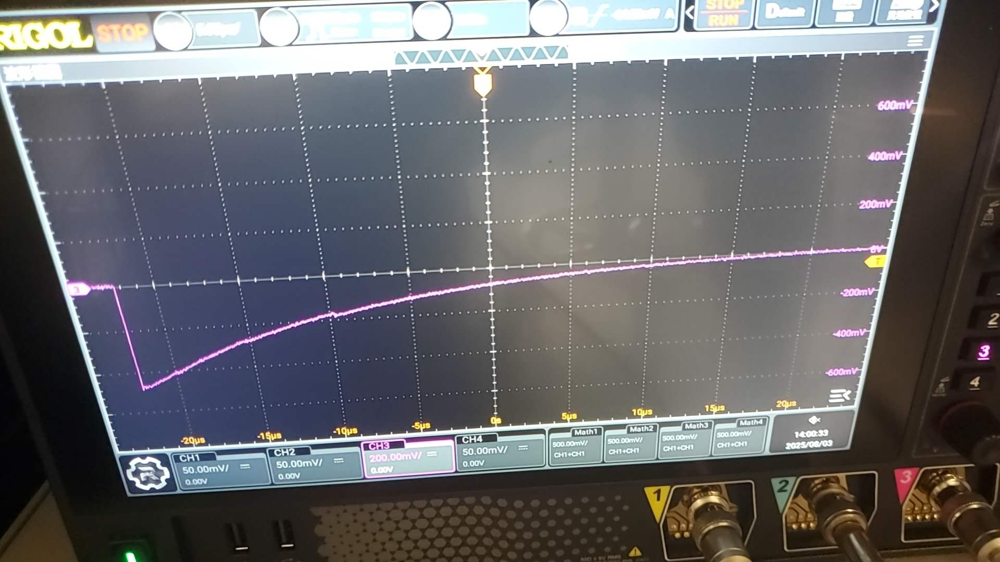

这个波形不好的，有很多波折，我怀疑可能是匹配的问题。 或者是采样率有点低。

<!-- (现在polarimeter的位置还没确定下来。 otsu 打算让我们放在前面.

联系哪些人？

哪个地方的磁场? 需要抗磁吗？) -->

我觉得确实是阻抗匹配的问题，

以下几幅图为50 $\Omega$ 

以下几幅图为 1M $\Omega$

公司的测试视频

可以发现，公司测试时候示波器估计使用的是1M欧姆阻抗。 下降时间40微秒量级。 这个参数也不行。

怀疑是base读出的问题，把幅度放小之后，这些小信号有很强的反射。 可能是在分压电路，或者滤波电路里有很强的反射。

1M欧姆的波形图，则是信号反复在PMY-传输线-示波器中反复反射叠加而来。 假设传输线长度大约为5ns的延迟，反射系数大约为$R_1 R_2 = 1 -10^{-4}$。 其中$R_2 = \frac{1M -50}{1M + 50} \approx 1 - 5*10^{-5}$。 

## 总结与汇报

### 闪烁体的发光过程

闪烁体的发光过程主要包括以下几个阶段：

1. **能量沉积**：高能粒子（如宇宙射线中的 μ 子）进入闪烁体材料后，通过电离和激发，将能量迅速沉积在材料中，时间尺度为皮秒或飞秒。
2. **激发态形成**：被激发的原子或分子形成激发态（如单重态和三重态），这是发光的前提。
3. **能量转移**：激发态通过非辐射过程（如偶极-偶极相互作用）将能量转移给发光中心分子，发生在纳秒量级。
4. **辐射跃迁**：发光中心分子从激发态跃迁回基态，释放光子（闪烁光），该过程具有特征的衰减时间，通常在纳秒量级。

### 关于波形“波折”的分析

从物理角度来看，波形顶部出现“波折”一般不是由闪烁体本身引起，主要原因如下：

- **指数衰减特性**：闪烁体发光过程可用指数函数描述（如 $I(t) = I_0 e^{-t/\tau}$），脉冲下降沿应为平滑曲线，不会出现明显波折。
- **能量沉积的瞬时性**：高能粒子的能量沉积极快，后续过程连续且平滑，不会导致脉冲顶部出现多个峰值或波动。
- **阻抗不匹配导致的振荡**：在高速电子学中，波形上的波折或振荡通常源于阻抗不匹配。信号在传输线上遇到阻抗不匹配时会发生反射，反射信号与原始信号叠加，导致波形出现振荡，其频率和幅度与阻抗不匹配程度及传输线长度有关。

### 阻抗匹配的电磁学原理

#### 传输线模型与电报方程

传输线可视为由单位长度电感 $L$ 和电容 $C$ 构成的分布参数电路。根据基尔霍夫定律，传输线上的电压 $V(x, t)$ 和电流 $I(x, t)$ 满足：

$$
\frac{\partial V(x, t)}{\partial x} = -L \frac{\partial I(x, t)}{\partial t}
$$

$$
\frac{\partial I(x, t)}{\partial x} = -C \frac{\partial V(x, t)}{\partial t}
$$

联立可得波动方程，说明信号以波的形式传播。

#### 信号反射与反射系数

信号从特性阻抗 $Z_0$ 的传输线进入负载阻抗 $Z_L$ 时，反射系数 $\Gamma$ 为：

$$
\Gamma = \frac{Z_L - Z_0}{Z_L + Z_0}
$$

- **理想匹配 ($Z_L = Z_0$)：** $\Gamma = 0$，无反射，波形平滑。
- **开路 ($Z_L \to \infty$)：** $\Gamma \approx 1$，信号全反射，易出现拖尾和畸变（如 1M$\Omega$ 阻抗下的波形）。
- **短路 ($Z_L \to 0$)：** $\Gamma = -1$，信号反相全反射。

波形“波折”通常由阻抗不匹配引起，反射信号与主信号叠加导致波形振荡。

#### 信号反射系数的推导

设传输线特性阻抗为 $Z_0$，负载阻抗为 $Z_L$。当电压波到达终端且 $Z_L \neq Z_0$ 时，部分能量会反射。

入射波和反射波的关系如下：

- 入射波：$V^+$，$I^+ = \frac{V^+}{Z_0}$
- 反射波：$V^-$，$I^- = -\frac{V^-}{Z_0}$

总电压：$V_{\text{total}} = V^+ + V^-$  
总电流：$I_{\text{total}} = \frac{V^+}{Z_0} - \frac{V^-}{Z_0}$

根据欧姆定律，负载处有 $V_{\text{total}} = Z_L I_{\text{total}}$，代入并整理后得到：

$$
\frac{V^-}{V^+} = \frac{Z_L - Z_0}{Z_L + Z_0}
$$

因此，反射系数 $\Gamma$ 为：

$$
\Gamma = \frac{V^-}{V^+} = \frac{Z_L - Z_0}{Z_L + Z_0}
$$

---

#### PMT输出到电缆的反射

在实际应用中，PMT的输出端可视为具有源阻抗 $Z_{\text{source}}$ 的信号源，电缆为特性阻抗 $Z_0$ 的传输线。

当 PMT 输出脉冲信号到电缆时，如果 $Z_{\text{source}} \neq Z_0$，会发生信号反射。此时，反射系数的定义为：

$$
\Gamma_{\text{source}} = \frac{Z_{\text{source}} - Z_0}{Z_{\text{source}} + Z_0}
$$

- **理想匹配**：$Z_{\text{source}} = Z_0$，$\Gamma_{\text{source}} = 0$，信号完全进入电缆，无反射。
- **阻抗不匹配**：$Z_{\text{source}} \neq Z_0$，$\Gamma_{\text{source}} \neq 0$，部分信号被反射回 PMT，导致波形畸变。

此处阻抗匹配的问题不仅可能发生在传输线和负载或者pmt之间，也发生在滤波电路之中。

