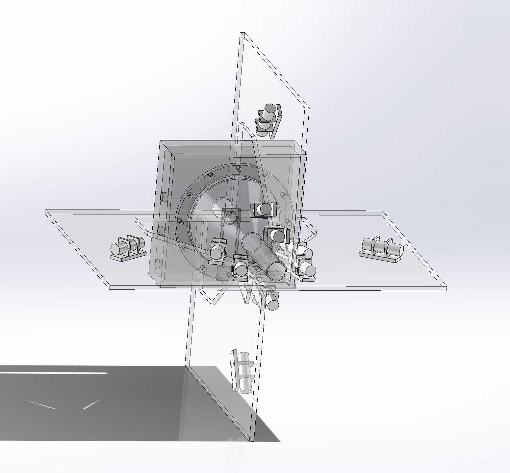
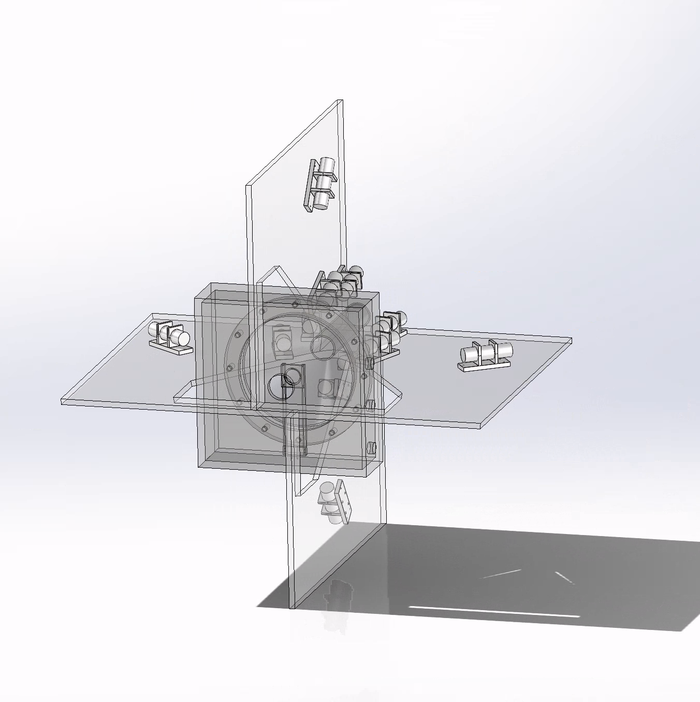

# 氘核极化探测器

deutron beam polarimeter

制作氘核极化实验中 束流极化测量的探测器.

## 参数

极化探测器,论文参数:

|particle | $\theta_{lab} $ |
|---|---|
|deutron | 20.87° |
|proton | 11.3° |
|proton | 55.9° |

后续solidoworks 参数:

| particle | angle | radius |
|----------|---|---|
| deutron | 20.9° | 0.4m |
| proton | 11.2° | 0.62m |
| proton | 53.4° | 0.62m |

detector radius 50mm ($\phi 50mm$)

现在dpolarization_archive/里默认也是按照solidowrks设计的.

问题在于old-version里的solidworks是参考的BigDPpolarization的全角度探测器设计的(圆锥的设计难以加工需要加工费)，而不是RCNP的BLP设计.

需要参考BLP 的设计,探测器摆放位置的参数按照solidoworks重新设计一套探测器布局图纸. 探测器外壳是直径50mm的圆柱. 保证探测器的前表面中心位于上述表格的角度和半径位置. 

采用freecad来画. 我需要亮光光探测器一个在samurai磁场之前测定实验中的磁场 画图文件放在infrontofSamuraiMag里, 另外一个在束流前面一些地方用于迅速反馈束流状态(前面的intensity 比较强) 画图文件放在upstreamBLP里.

## freecad 画图 infrontofSamuraiMag

<!-- 靶子支架 -->
target support

<!-- 靶室, 前后管道开口为 -->
target chamber

<!--  探测器夹具 -->
detector support

<!-- 探测器放置平台 -->
detector platform

<!-- 连接固定装置 防止到地板上  -->

## freecad 画图 upstreamBLP

前面必须和束流接口对上, 保持真空